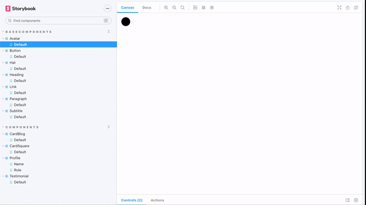

# wireframe-library

> A React components library with theme inspiration in wireframes

> Inspired by figma file [Wireframing](https://www.figma.com/file/GBCGqs11KNeUyPksQzEMw0hr/Wireframing/duplicate), (found in wireframe templates free)

## Example


## Install

```bash
npm install --save wireframe-library
```

## Usage

```jsx
import React, { Component } from 'react'

import MyComponent from 'wireframe-library'
import 'wireframe-library/dist/index.css'

class Example extends Component {
  render() {
    return <MyComponent />
  }
}
```

## License

MIT © [caiotriana](https://github.com/caiotriana)
